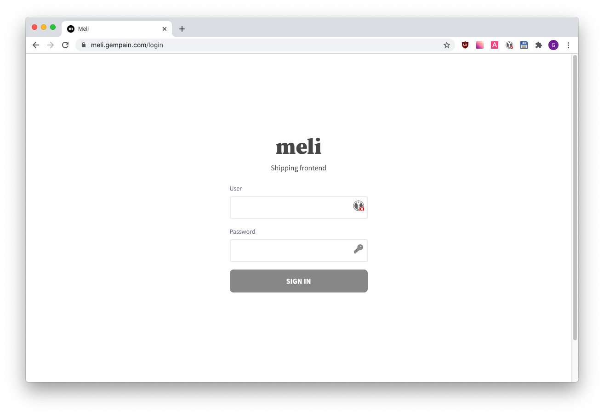

# Installation

## Getting started

Requirements:
- a VPS
- Docker and Docker Compose (see [here](https://docs.docker.com/engine/install/ubuntu/#install-docker-engine) for how to install on Ubuntu)

### 1. Configure DNS

Configure DNS records to point to your VPS. You should configure **both** the **main** and **wildcard** domains. Assuming your VPS's IP is `1.2.3.4`:

<div class="code-group">

```txt
meli.company.com IN A 1.2.3.4
*.meli.company.com IN A 1.2.3.4
```

</div>

<div class="blockquote" data-props='{ "mod": "info" }'>

Your cloud provider should have a user interface that allows you to configure DNS records.

</div>

### 2. Deploy Meli on your VPS

1. Create a file named `docker-compose.yml` anywhere you want:

    <div class="code-group">
    
    ```yaml
    version: "3"
    
    services:
    
      meli:
        image: getmeli/meli:beta
        ports:
          - 80:80
          - 443:443
        environment:
          # no trailing slash !
          MELI_URL: https://meli.company.com
          MELI_MONGO_URI: mongodb://mongo:27017/meli
          # openssl rand -hex 32
          MELI_JWT_SECRET: changeMe
          # https://docs.meli.sh/authentication
          MELI_USER: user
          MELI_PASSWORD: changeMe
        volumes:
          - ./data/sites:/sites
          - ./data/caddy/data:/data
          - ./data/caddy/config:/config
        depends_on:
          - mongo
    
      mongo:
        image: mongo:4.2-bionic
        restart: unless-stopped
        volumes:
          - ./data/mongo:/data/db
    ```
    
    </div>
    
    <div class="blockquote" data-props='{ "mod": "info" }'>
    
    To prevent your users from creating organizations, we set `MELI_MAX_ORGS` to `1` by default. You can disable this by setting `MELI_MAX_ORGS=0`.
    
    </div>

2. Run `docker-compose up -d`
3. Browse at `meli.company.com`, and you should see the login page



## Next steps

- [Uploading sites](/get-started/upload-a-site-to-meli)
- [Other authentication methods](/authentication)
- [Configure Emails](/configuration/emails)
