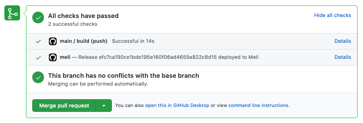

# Pull Request Previews

When you upload a site to Meli, the Meli CLI will tell your Git server where your site can be previewed.

## GitHub

To get Github Pull Request previews, make sure the `GITHUB_TOKEN` environment variable is defined when the Meli CLI si executed. This token should have the `repo` scope.

Now, you'll get links to your pull request deployment previews (click **Details**):

## Gitlab

To get Gitlab deploy links, make sure the `GITLAB_TOKEN` environment variable is defined when the Meli CLI si executed. This token should have the `repo` scope.

## Gitea

To get Gitea deploy links, make sure the `GITEA_TOKEN` environment variable is defined when the Meli CLI si executed. This token should have the `api` scope.
