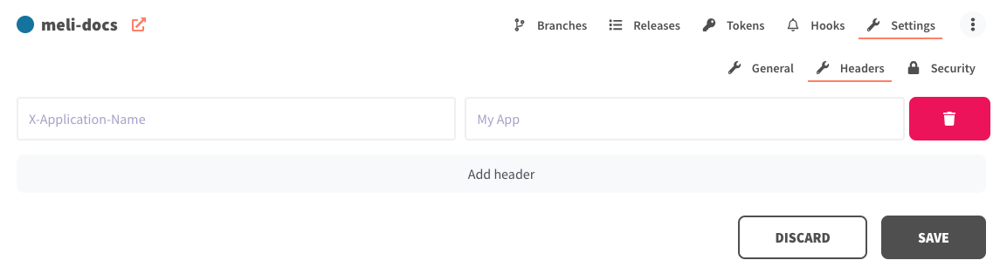
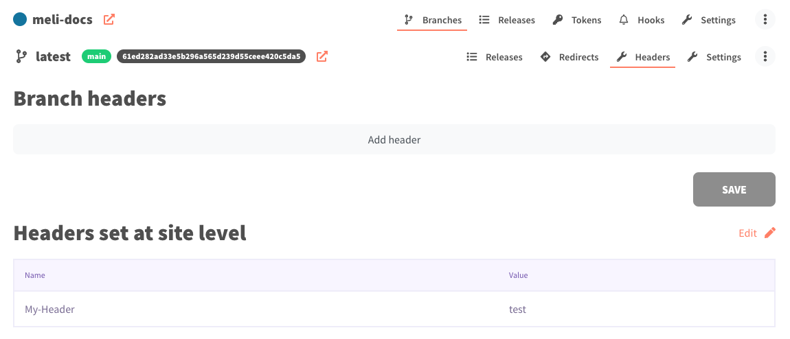

# Custom headers

## At the site level

Custom headers may be defined at the site level:

## At the branch level

Custom headers may be defined at the branch level. When a header is defined at the site and branch level, the value defined in the branch
will override that from the site.

